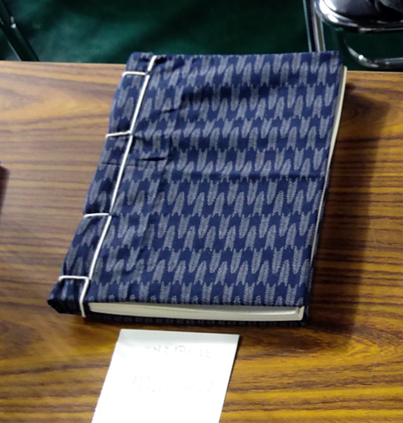

## 概要
貴方もMNEpythonで脳研究をしてみませんか？
本書はMNEpythonに関する初心者向け和書です！
現物は和装本として製本しています。

## 本のダウンロード
[ここ](https://github.com/uesseu/MNE-Doujinshi/raw/master/out.pdf)←を右クリックでダウンロードして読むと良いと思います。

# MNEpython同人誌
初心者による初心者のためのMNEpythonの解説の同人誌でした。  
2020年、コミックシティ福岡51にサークル参加しましたが一冊も売れませんでした、タヒね！
その後、一時期更新が途絶えました。
2023年、引き継ぎとかコミュニケーションの手段として更新しました。

間違いが時々書かれているのを修正していっているので、最新版を強く推奨。

## マサカリについて
教えてくれると凄くうれしいです。
でも、これあくまで趣味なんで、あんま怖いこと言わないでほしいです。
ぷるりくしてもらっても良いんですが、ぼっちなのでチーム開発したことないです。
だから、失礼なこと言っちゃうかも…。

## 翻訳について
もし協力してくれる人がいるならそれも面白いかもｗ
でも、一人じゃ無理！英語苦手なんです><
