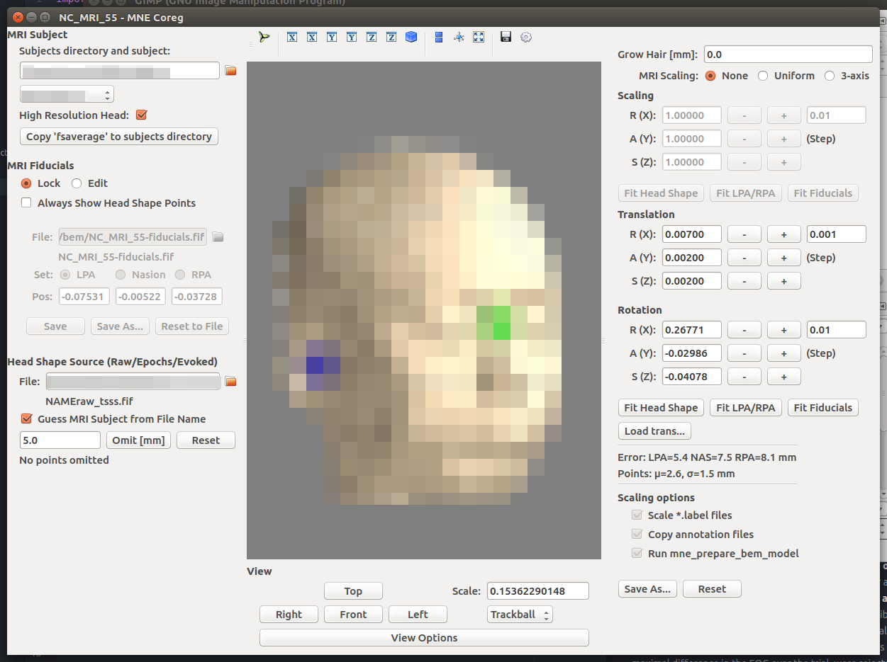

# ソースレベルMEG解析

ついにソースレベルの解析を行います。これがMNE/pythonの真髄です。
すこし難しいのです。頑張りましょう。

ソースレベル解析については冒頭の記述を見ていただくとして、
早速MRIとMEGをくっつけていきます。
(MRIがない場合は標準脳を使えるけど、あまり感心しない)
目標は「脳内の信号を算出するための式を作る」事です。
式さえできればなんとか計算できるわけです。
必要物品は以下の通り

- 脳の中の見たい場所リスト(MRI)
- センサーの位置情報(Montage)
- 脳波か脳磁図
- 皮膚や頭蓋骨の抵抗値や、その分布(BEM)

このなかで、MRIについては標準脳を使うのでなければ
freesurferでrecon-allをしたデータが必要です。
前述しましたので、頑張って下さい。
一晩かかります。

これらを使って何をするかと言うと、
脳の中の活動と、センサーで捉えた結果で鶴亀算を解いてあげるのです。
さて、これは理工系の人は知っているのですが、実は鶴亀算は割り算です。
(ここで文系や医学部の人はびっくりする)
一応、鶴亀算が割り算であることの解説記事を書いたので、
数学習ってなかった人やサボっていた人はご参照ください。
[https://qiita.com/uesseu/items/750c236bfa706c361b3b](https://qiita.com/uesseu/items/750c236bfa706c361b3b)

さて、脳の中の電気の活動量をX、
センサーで捉える磁場とか電場とかをYとすると
$AX = Y$という形式に落とし込めるはずです。
これは高校物理をちゃんと勉強した人は直感的に分かるはず。

ここのAを計算するために、抵抗とか距離とかが必要なんですね！
このAを求めることをForwardSolutionという感じに言います。
ここから$X = A^{-1}Y$という風に変えればXを計算できます。
これをInverseSolutionと言い、$A^{-1}$のことを
InverseOperatorと言います。
鶴亀算は割り算なのでこのInverseOperatorを
求めることが当面の目標です。

手順としては以下のとおりです。


## 掛け算を作る
まずは、掛け算を作るために、脳の中の位置情報、
センサーの位置情報、そして、その両者がどのように重なっているかの
位置関係を求める必要があります。

1. MRIから脳の形を取ってきて、骸骨の抵抗とかも加味して計算できる形にする。
 これをBEMという。これを使って掛け算の形にする。
1. 脳の形から「推定する脳部位の位置」を特定する。
 この脳内の位置情報をソーススペース(source space)という。
 (鶴亀算の鶴と亀のいる場所を計算する)
1. 「推定するべき脳の部位」とEEG/MEGのセンサーの位置をすり合せて
 両者の位置関係を求める。この作業は手動で行われる。(超絶めんどい)
 この重ね合わせ情報はtransというファイル形式で保存される。
1. 脳の部位情報と頭の形情報とセンサーの位置から、
 脳活動によってどのようにセンサーに信号が届くかを計算する。
 これを脳磁図における順問題(forward solution)という。
 これにより、掛け算が求められる。

## 割り算を作る
次に割り算を作ります。
MNEやsLORETAやdSPMといった何やら難しげな手法は、
この割り算を作るときのやり方の違いなのです。

1. 綺麗な割り算をするためのcovariance matrixを作る(理屈は後述)。
1. 上記の脳部位とセンサーの関係性から、特定の脳部位での電源活動の波形を推定する。
 これを脳磁図における割りざ…逆問題(inverse solution)という。
 割り算は逆数の掛け算と同じであるから、掛け算に置き換える。
 この時の逆数のことをInverseOperatorという。
 この割り算に決まった解答はない。「最も良い解を得る方法」が幾つか提案されている。
1. 脳全体で推定した波形のうち、欲しいものをとってくる。

本当にこれだけ。
なんと、脳の計算とは割り算なのであった！
ね？簡単でしょう？

簡単に言いましたが、これが割り算である事を数学的にちゃんと理解するには
ラグランジュの未定乗数法によって導かれる行列の微分方程式を
解かねばなりません。あとでかるーく触れます。

その後は色々なストーリーがあるでしょう。

## その後のストーリー

- 推定された波形をwavelet変換する。
- PSDやERPをしてみる。
- 脳の各部位のコネクティビティを算出する。
- 何か僕達が思いつかなかった凄いアイデアを実行する。

などなど。
でははじめましょう。

## 手順1、trans
まず、脳とセンサーの位置をすり合わせておきましょう。

GUIでの操作となります。ふた通りの動かし方があります。
下記のコードを実行すると画面が立ち上がります。

pythonで
```{frame=single}
from mne.gui import coregistration
coregistration()
```

bashで
```{frame=single}
mne coreg
```
mne coregコマンド簡単ですね！

subjectやmegへのpathを指定しない場合は、GUI上で指定することになります。
もし0から立ち上げた場合、山のようにあるMRIのsubjectから該当の
subjectを探さねばならなくなります。

pythonの関数に色々入れてから起動すれば、
既にデータが読み込まれているので、楽です。
```{frame=single}
coregistration(subject = subject,
               subjects_dir = subjects_dir,
               inst = file_path)
```
instはmegデータ…rawでもepochでも良いらしいですが、どれかを指定して下さい。

{width=14cm}

手順はこうです。

1. 必要ならば、MRIのsubjectを読み込む
1. 必要ならば、fifファイルを読み込む
1. 左側、setのところで耳と眉間の位置を入力
 (MEGならスタイラスでポチるところ)
1. それの一寸上の所、lockをポチる。
1. 面倒なら右側、Fit LPA/RPAボタンとかを押す。
1. 表示された黄土色の生首をマウスでグリグリしながら、
 右上の±ボタンを押して調整。
1. ちゃんとfitしたら右下のsave as ボタンを押して保存。

あとで、保存したtransを
```{frame=single}
from mne import read_trans
trans = read_trans('/Users/hoge/fuga/trans.fif')
```
みたいな感じで読み込んで使います。
右上のボタンを押した場合は黄土色の生首の大きさが変わってしまうので、
freesurferのsubjectに別名をつけて保存する必要があります。

ほかに注意点として、脳波とかの場合は表示が
projectionモードになっていたりして見にくかったりするかもです。
色々調整してみてください。


## 手順2、BEM作成
脳からセンサーまでの抵抗を計算せねばなりますまい。

上記の通り、MRIから抽出してくる形データとして、BEMと言うものを使います。
BEMは脳の全体を包み込むサランラップみたいなデータです。
頭蓋骨とか皮とか、そういう抵抗が強いものを考慮するために、BEMは三枚一組で
出力されます。実装上は3枚あるということを意識しなくても大丈夫です。

作るためにはfreesurferによる解析データが必要となります。
freesurferを既に使っているならSubject関連は既に馴染んだ言葉でしょうか？
もちろんSUBJECTやSUBJECTS_DIRは読み替えてください。
```{frame=single}
mne watershed_bem -s subject -d subjects_dir
```

これにより、freesurferのサブジェクトの中にBEMが作成されました。
再びpythonに戻り、下記を入力してみてください。
```{frame=single}
from mne.viz import plot_bem
plot_bem(subject=subject,
         subjects_dir=subjects_dir,
         brain_surfaces='white',
         orientation='coronal')
```
これでBEMが表示されるはずです。

{width=14cm}

もし、標準脳を使うなら、以下のコマンドをターミナルから叩いて下さい。
```bash
mne coreg
```
guiの画面が現れると思います。
'fsaverage→SUBJECTS_DIR'というボタンを押して下さい。
freesurferの標準脳であるfsaverageが現れます。
以降、subjectにはfsaverageを入れると標準脳を使うことになります。

## 手順3、ソーススペース作成
脳内の位置情報を作りましょう。

脳磁図で見れる空間のうち、どの部分の電源を推定するかを
設定する必要があります。その設定がソーススペースです。
subjects_dirは環境変数に設定していれば要らないです。
環境変数ってのはbashrcとかbash_profileとかに書くやつです。
一応前述しています。
```{frame=single}
from mne import setup_source_space
src = setup_source_space(subject=subject,
                         spacing='oct6',
                         subjects_dir=subjects_dir)
```
もちろん、標準脳が欲しい場合は黙ってfsaverage。
暫く待ちます。
これで、srcという変数にソーススペースが入りました。

さて、見慣れぬ単語が出てきました。oct6とは何でしょうか？
それはここに書いてあります。
[http://martinos.org/mne/stable/manual/cookbook.html#setting-up-source-space](http://martinos.org/mne/stable/manual/cookbook.html#setting-up-source-space)

ソーススペースを作るためには計算上正十二面体や正八面体で
区画分けするので、その設定ですね。
やり方によってソーススペースの数も変わるみたいです。
臨床的に意味があるかはわかりません。

標準脳を使う場合は'fsaverage'をsubjectに指定して下さい。
ない場合は手順2のmne.gui.coregistration()でボタンを押して下さい。

{width=14cm}

## 手順4、順問題
まずは掛け算を作ります。

先程作ったBEMは3枚あります。
EEGの場合は3枚必要です。何故なら、磁力と違って電力は
脳脊髄液と頭蓋骨と頭皮を素通りしにくいからです。
だから、BEMを三枚仮定するのです。
MEGの場合は一枚だけで十分だそうです。

では、BEMで順問題を解く準備をしましょう。
```{frame=single}
from mne import make_bem_model, make_bem_solution
conductivity = (0.3,)
model = make_bem_model(subject='sample',
                       ico=4,
                       conductivity=conductivity,
                       subjects_dir=subjects_dir)
bem = make_bem_solution(model)
```
これにより、BEMを読み込み、順問題解きモードに入りました。
icoはどの程度細かく順問題を解くかの数値です。icoの数字が高いほうが詳しいです。
conductivityは電気や磁力の伝導性のパラメータです。
EEGの場合はこれが(0.3, 0.006, 0.3)とかになったりします。

では、先程作った色々なものと組み合わせて順問題を解きます。
```{frame=single}
from mne import read_trans, make_forward_solution
trans = read_trans('/hoge/fuga')
mindist = 5
fwd = make_forward_solution(raw.info,
                            trans=trans,
                            src=src,
                            bem=bem,
                            meg=True,
                            eeg=False,
                            mindist=mindist,
                            n_jobs=4)
```
ここまでやった方にとって、上記のパラメータはだいたい分かるでしょう。
mindistは頭蓋骨から脳までの距離です。単位はmm。
ここで使うのはraw.infoです。epochs.infoでもいいかも。


## 手順5、コヴァリアンスマトリックス関連

MNEによる推定にはcovariance matrixというものを使って
割り算を綺麗にやります。
これにはMEGを空撮りした空データや、
刺激提示されてないときのデータなどを使います。下記で計算します。
```{frame=single}
from mne import compute_covariance
cov = compute_raw_covariance(raw_empty_room,
                             tmin=0,
                             tmax=None)
```

ちなみに、刺激提示されてないときの計算は下記のとおりです。

```{frame=single}
from mne import compute_covariance
cov = compute_covariance(epochs,
                         tmax=0.,
                         method='auto')
```
ちなみに、このmethod=autoというのはMNEに実装された新しいやり方だそうです。
tmax=0にしているので、刺激が入る前までの波を取り除きます。
つまりベースラインコレクションみたいな感じになるのです。
ちなみに、epochsでcovariance…特にautoですると結構重いです。


## 手順6、逆問題

最終段階、割り算です。
順問題とcovariance matrixを組み合わせて割り算の形にしましょう。
下記のとおりです。

```{frame=single}
inverse_operator = make_inverse_operator(epochs.info,
                                         fwd,
                                         cov,
                                         loose=0.2,
                                         depth=0.8)
```
inverse_operatorと言うのは何かというと、逆問題を算出するための式です。
このinverse_operatorを作るために頑張ってきたと言っても過言なしです。

ここで、第一引数にepochs.infoを入れていますが、infoなら
rawでもevokedでも良いはずです。

さて、ここでlooseとdepthという耳慣れぬ物が出てきました。
一寸大事なパラメータです。
脳内の電流源推定と言っても、電流の向きを考慮しなくてはならないわけです。
looseはその向きがどのくらいゆるゆるかの指標です。
脳磁図はコイルで磁場を測る関係上、**脳の表面と水平な方向**の成分を
捉えやすいように出来ています。
でも、脳波複雑だから完全な水平ってないよね？どのくらいのを想定する？
という風なパラメータです。
looseは0〜1の値をとりますが、looseが1というのは超ユルユル、
どの方向でも良いですよということです。
ちなみに、looseが0の時は一緒にfixedをTrueにする必要があります。
fixedがTrueの時は、MNEpythonが脳の形に沿って自動調整してくれます。

depthは何かというと、どのくらい深い部分を見たいか、です。
MNEという計算手法は脳の表面の情報を拾いやすい偏った計算方法です。
故に、深い部分に対して有利になるようにする計算方法があります。
depthを設定すると、脳の深い所を探れるわけです。
depthをNoneに設定すると、ほぼ脳の表面だけ見ることになります。

他にlimit_depth_chsというパラメータもあります。
これをTrueにすると、完全に脳の表面だけ見ます。
即ち、マグネトメータをやめて、グラディオメータだけで見るのです。


ここまで長かったので保存しておきましょう！
```{frame=single}
write_inverse_operator('/home/hoge/fuga',
                       inverse_operator)
```
このinverse_operatorが作れたら、あとは色々出来ます。

## 手順7 ソース推定

まずは、ソース推定をやってみましょう。
```{frame=single}
from mne.minimum_norm import apply_inverse
source = apply_inverse(evoked, inverse_operator, 1 / 9)
```

ちなみに、ここではevokedを使っていますが、
epochsならapply_inverse_epochs、
rawならapply_inverse_rawです。

```{frame=single}
from mne.minimum_norm import apply_inverse_epochs
source = apply_inverse_epochs(evoked, inverse_operator, 1 / 9)
```

```{frame=single}
from mne.minimum_norm import apply_inverse_raw
source = apply_inverse_raw(evoked, inverse_operator, 1 / 9)
```

ちなみに、epochsの場合はlistを返します。
listの内容はSourceEstimate , VectorSourceEstimate , VolSourceEstimateです。
SourceEstimateがBemベースの結果ですね。

一旦、これを視覚化してみましょう。
```{frame=single}
source[0].plot(time_viewer=True)
```

やりました！これぞ、MNEの真髄、割り算であります！

このtime_viewer=Trueは時間を追って見ていきたい時に
つけると良いオプションです。


さて、これで出てきたsourceの中にdataという変数があります。
まさに膨大な数です。脳内の膨大な場所について電流源推定したのです。
これは、一つ一つが脳内で起こった電流と考えて良さそうです。
細かい所は公式サイト見てください。

こんな膨大な数列があっても困りますよね？
脳のどこの部位なのかわかりませんし。
そこで、freesurferのラベルデータを使います。
それによって、脳のどの部分なのか印をつけてやるのです。

## 手順8、前半ラベル付け
freesurferにはいくつかのアトラスがあります。
アトラスとは、地図みたいなものですね。

詳しくはここをみて下さい。
[https://surfer.nmr.mgh.harvard.edu/fswiki/CorticalParcellation](https://surfer.nmr.mgh.harvard.edu/fswiki/CorticalParcellation)
desikan atlasとかDestrieux Atlasとか色々ありますよね。
こういうのを読み込まねばなりません。
ターミナルでこのように打ってみて下さい。
```{frame=single}
ls $SUBJECT_DIR
```
もしfreesurferを既に動かしているならば、
解析済みのMRIが沢山あるはずです。
サブジェクトの中身にはlabelというディレクトリがあります。
この中にいっぱいそういうfreesurferのアトラスが入っています。

ファイルの形式には二種類あり、annot形式とlabel形式があります。
annot形式は新しく開発されたアトラスが入っていて、
label形式はブロードマンと思います。
annot形式の内容はこのように読みます。
```{frame=single}
mne.read_labels_from_annot(subject,
                           annot_fname='hoge')
```
詳しくは公式サイト(ry
他にも読み方があります。
こうして読んだら、labelのリストが出てきます。
単体のlabelは下記で。
```{frame=single}
mne.read_label(filename, subject = None)
```

これでlabelを読み込めたら、次はそれを当てはめることになります。

### 手順8後半、label当てはめ

では、labelをベースにデータを抜き出しましょう。

```{frame=single}
from mne import extract_label_time_course
source_label = extract_label_time_course(stcs,
                                         labels,
                                         src,
                                         mode='mean_flip')
```

ここではstcがソースのデータ、srcが左右半球のソーススペースのリストです。
modeはいくつかあります。
mean: それぞれのラベルの平均です。これを使うのが普通でしょうか…
mean_flip: 特異値分解を使ってベクトルが違うやつも取り出すのです。
pca_flip: PCAを使って取り出してくるのです。
max: ラベルの中で最大の信号が出てきます

これで脳内の波形が取り出せたわけです。
これで、色々出来ます。なにしろ、今までwavelet等していたわけですから。

でも、これだけじゃダメですね。きちんと視覚化しないと。
ここで、mayaviとpysurferが登場します。
mayaviは三次元を表示するパッケージ、
pysurferはfreesurferをmayaviを使って表示するパッケージですね。

```{frame=single}
from mne.minimum_norm import apply_inverse_epochs

hoge = 4
source = apply_inverse_epochs(evoked, inverse_operator, 1 / 9)
brain = source[0].plot(subjects_dir=subjects_dir, time_viewer=True)
labels = read_labels_from_annot('fsaverage', subjects_dir=subjects_dir)
brain.add_label(labels[hoge])
```
これにより、きちんと脳の部位にラベルをつけたまま脳活動を表示できます。
でも、実はこの方法だけじゃラベルつけたまま時系列表示できません。
時系列表示します。

```{frame=single}
from mayavi import mlab
import surfer

hoge = 4
scene = mlab.figure()
source = apply_inverse_epochs(evoked, inverse_operator, 1 / 9)
source[0].plot(subjects_dir=subjects_dir,
               time_viewer=True,
               figure=scene)
labels = read_labels_from_annot('fsaverage',
                                subjects_dir=subjects_dir)
b = surfer.Brain('fsaverage',
                 'lh',
                 'inflated',
                 subjects_dir=subjects_dir,
                 figure=scene)
b.add_label(labels[hoge])
```

何やってるかと言うと、mayaviで一旦canvas的なものを作って、
そこに一寸ずつ書き加えているイメージです。


### その後のお楽しみ1、ソースベースwavelet

ソースベースでwaveletやりたいなら、特別に楽ちんな関数が
実装されています。

induced_powerとphaselocking_factorを算出する関数は下記です。
※labelを選ばなければ激重注意！[^gekiomo]
```{frame=single}
induced_power, itc=source_induced_power(epochs,
                                        inverse_operator,
                                        frequencies,
                                        label,
                                        baseline=(-0.1, 0),
                                        baseline_mode='zscore',
                                        n_cycles=n_cycles,
                                        n_jobs=4)
```
基本は以前wavelet変換で行った事に、いくつか追記するだけです。
まず、ベースラインコレクションはここではzscoreでしています。
やり方は色々あります。labelはfreesurferのラベルデータです。
baseline補正の時間についてはデータの端っこすぎると値がブレるので、
そこのところはデータ開始時点〜刺激提示の瞬間の間で適切な値にしておいてください。
これで算出されたwavelet変換の結果の取扱は、前に書いたwavelet変換の結果と同じです。

[^gekiomo]:labelを選ばない場合これは激重です。何故なら306チャンネルのMEGからソースに落とし込むと計算方法によっては10000チャンネルくらいになります。ROIを絞ったとしても「人数×タスク×ROIの数×EPOCHの数」回wavelet変換してpowerとitcに落とし込むのですから…途方もない計算量です。labelを選びましょう。

### その後のお楽しみ2、ソースベースconnectivity

ソースベースでコネクティビティ出来ます。
```{frame=single}
from mne.connectivity import spectral_connectivity
con, freqs, times, n_epochs, n_tapers=spectral_connectivity(
             source_label, method='coh', mode='multitaper',
             sfreq=500, fmin=30,
             fmax=50, faverage=True, mt_adaptive=True)
```
使い方はセンサーベースコネクティビティと同じです。
この場合、さっき計算して出したラベルごとのデータと、
ラベルリストを放り込めば、先述の5つの変数が出てくるので楽ちんです。

## *コラム3-markdownで同人誌を書こう！*

```{basicstyle=\normalfont frame=shadowbox}
皆さんもこのような科学系同人誌書きたいですよね？
書いてコミケにサークル参加したいですよね？
**難しいLaTexなんて覚えなくても大丈夫。そう、markdownならね！**
LaTeXは添えるだけ。手順は下記。

macならmactexとpandocをインストールします。
ubuntuやwindowsならTeXliveをインストールします。
mactexはググれば出てきます。pandocは
brew install pandoc

ubuntuなら
sudo apt install texlive-lang-japanese
sudo apt install texlive-xetex
sudo apt install pandoc

これでpandocでmarkdownからpdfに変換できるようになります。
例えばDoujinshi.mdというマークダウンファイルを作って

pandoc Doujinshi.md -o out.pdf \
-V documentclass = ltjarticle --toc --latex-engine = lualatex\
-V geometry:margin=1in -f markdown+hard_line_breaks --listings

四角で囲われているところはコードの引用の書式に従って書いた後、
コードの上の```の末尾に{frame=single}と書き加えてください。

これで同人誌に出来るPDFになります。詳しくはググってください。
良い同人ライフを！
```
